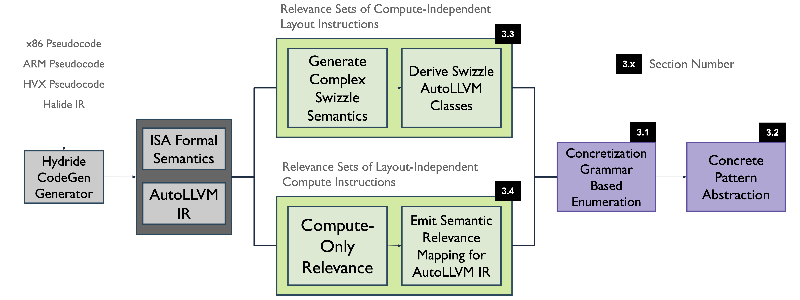

# Overview

MISAAL is a program synthesis-based framework for automatically generating retargetable semantics driven optimizations and code-generation for target architectures with their Instruction Set Architectures described in Pseudocode. 

## Publications
* Abdul Rafae Noor, Dhruv Baronia, Akash Kothari, Muchen Xu, Charith Mendis, Vikram Adve, "[MISAAL: Synthesis-Based Automatic Generation of Efficient and Retargetable Semantics-Driven Optimizations](https://hydride.cs.illinois.edu/files/2025/04/MISAAL-PLDI-Camera-Ready-3.pdf)", 46th ACM SIGPLAN Conference on Programming Language Design and Implementation (_PLDI 2025_)

* Akash Kothari+, Abdul Rafae Noor+, Muchen Xu, Hassam Uddin, Dhruv Baronia, Stefanos Baziotis, Vikram Adve, Charith Mendis, Sudipta Sengupta, "[Hydride: A Retargetable and Extensible Synthesis-based Compiler for Modern Hardware Architectures](https://hydride.cs.illinois.edu/files/2024/05/Hydride.pdf)", ACM International Conference on Architectural Support for Programming Languages and Operating Systems (+ **Equal Contribution**) (_ASPLOS 2024_)

